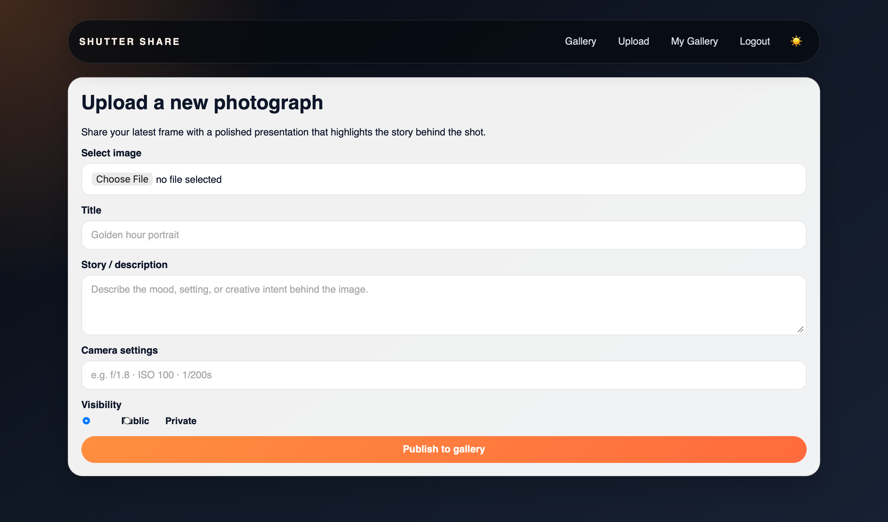

# Shutter Share

Shutter Share is a photography-focused community web app where users can sign up, upload their work, browse a public gallery, view photo details, and leave feedback through reviews.

## Overview

This project was built as a full-stack web application using Node.js, Express, EJS, MongoDB, and Cloudinary. It combines authentication, image upload, personal galleries, and community interaction in a single polished experience.

## Features

- User authentication with sign up, sign in, sign out, and password reset
- Public photo gallery for browsing community work
- Secure photo upload with Cloudinary image hosting
- Personal gallery for each logged-in user
- Photo detail page with title, description, camera settings, and reviews
- Review creation and deletion for community feedback
- Light/dark theme toggle for a more polished experience
- Responsive design for desktop and mobile screens

## Screenshots





## Technologies Used

- Node.js
- Express.js
- EJS templates
- MongoDB with Mongoose
- Cloudinary for image storage
- Multer and multer-storage-cloudinary
- bcrypt for password hashing
- express-session for authentication
- nodemailer for password reset emails
- Custom CSS for the user interface

## Getting Started
**Check out the live app here:**  https://shutter-share.onrender.com

### Prerequisites

- Node.js installed
- MongoDB database available
- Cloudinary account for image uploads
- A Gmail app password if using the built-in password reset email flow

### Installation

1. Clone the repository:
   ```bash
   git clone https://github.com/ALIALSAEED313/shutter-share
   cd shutter-share
   ```

2. Install dependencies:
   ```bash
   npm install
   ```

3. Create a .env file in the project root with the following variables:
   ```env
   PORT=3000
   MONGODB_URI=your_mongodb_connection_string
   SESSION_SECRET=your_session_secret
   BASE_URL=http://localhost:3000
   CLOUDINARY_CLOUD_NAME=your_cloudinary_cloud_name
   CLOUDINARY_API_KEY=your_cloudinary_api_key
   CLOUDINARY_API_SECRET=your_cloudinary_api_secret
   GMAIL_APP_PASSWORD=your_gmail_app_password
   ```

4. Start the application:
   ```bash
   npm start
   ```

5. Open your browser and visit:
   ```text
   http://localhost:3000
   ```

## Project Structure

- controllers/ - Route handlers for authentication and photos
- middleware/ - Authentication, sessions, and upload logic
- models/ - Mongoose schemas for User, Photo, and Review
- public/ - Static assets and CSS
- views/ - EJS templates for pages and partials
- server.js - Main Express server entry point

## User Stories

- As a new visitor, I want to register for a new account with a username and password so that I can participate in the community.
- As a registered user, I want to securely log in and log out so that my portfolio remains protected when I step away from my computer.
- As a photographer, I want a dedicated gallery page that displays only the photos I have uploaded so that I can share a single link to my personal portfolio.
- As a visitor, I want to view a main feed of all uploaded photos so that I can discover new art and get inspiration.
- As a photo owner, I want to edit my photo details so that I can fix mistakes without re-uploading the image.
- As a photo owner, I want to delete my photo so that I can remove work I no longer want to share.
- As a logged-in user, I want to write a review on someone else’s photo so that I can offer feedback or praise.
- As a review author, I want to delete my own review if I change my mind or post the wrong comment.
- As the system, I want to restrict upload and edit actions from guests so that unauthorized users cannot alter the database.

## Routes

| Method | Route | Description |
|--------|-------|-------------|
| GET | /auth/sign-up | Show the sign-up form |
| POST | /auth/sign-up | Create a new user account |
| GET | /auth/sign-in | Show the sign-in form |
| POST | /auth/sign-in | Authenticate the user |
| GET | /auth/sign-out | End the current user session |
| GET | /auth/forgot-password | Show the password reset request form |
| POST | /auth/forgot-password | Send a reset email |
| GET | /auth/reset-password/:token | Show the reset password form |
| POST | /auth/reset-password/:token | Update the password |
| GET | /photos | View the main gallery |
| GET | /photos/new | Show the upload form |
| POST | /photos | Upload and save a new photo |
| GET | /photos/my-gallery | Show the logged-in user’s photo gallery |
| GET | /photos/:photoId | View a single photo and its reviews |
| GET | /photos/:photoId/edit | Show the edit form |
| POST | /photos/:photoId | Update photo details |
| DELETE | /photos/:photoId | Delete a photo |
| POST | /photos/:photoId/reviews | Add a review |
| GET | /photos/:photoId/reviews/:reviewId/edit | Show the review edit form |
| PUT | /photos/:photoId/reviews/:reviewId | Update a review |
| DELETE | /photos/:photoId/reviews/:reviewId | Delete a review |

## Database Models

- User - stores account information, profile name, and password reset token data
- Photo - stores title, image URL, camera settings, description, owner, visibility, and reviews
- Review - stores review text, author, and the associated photo

## Future Enhancements

- User profile pages with richer bios and portfolio sections
- Likes, favorites, and follows
- Search and filtering by category, camera, or photographer
- Better moderation and admin tools
- Mobile-first performance improvements


## Credits

Built By : Ali Alsaeed